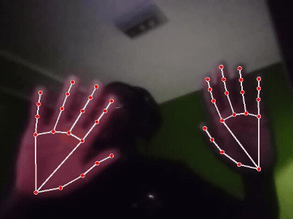

# HandTracing

Esse projeto é uma aplicação dos conhecimentos adquiridos nos cursos da Alura utilizando **Python**, **OpenCV** e **Mediapipe**.

---

## Organização do projeto

```text
HandTracing/
├── documentacao/          # Fotos das anotações feitas à mão
├── curso/                 # Códigos e anotações do curso
├── HandTracingSoftware/   # Software principal
└── README.md
```

# Mapeamento dos pontos da mão

<div>
  <table>
    <tr>
      <td>
        # Mapemento com webcam
  
        </td>
      <td>
        
      </td>
      </tr>
  </table>
  
  </div>

